# Kenya Gazette library roadmap — v1

Companion to [`library-contract-v1.md`](library-contract-v1.md). Supplies the
three deliverables from
[`kenya-gazette-library-ideation-prompt.md`](../analysis/kenya-gazette-library-ideation-prompt.md)
that the contract intentionally leaves out: architecture options, recommended
default plus MVP-1.0 scope, and a milestone roadmap with comparability rules.

---

## Terms used in this doc

Short glosses for terms that appear repeatedly. Skip if they are familiar.

- **MVP** — Minimum Viable Product. The smallest cut of the library that is
  useful to a real consumer; here it means "what ships in version 1.0."
- **Pydantic** — Python library for declaring data shapes as classes that
  validate input and serialize to JSON. We use it to lock the output
  envelope.
- **Envelope** — the top-level JSON object the library returns from one
  PDF. Defined in contract section 3.
- **Schema (in `schema_version`)** — the documented shape of the
  Envelope JSON: which fields exist, their types, what they mean.
- **MAJOR / MINOR / PATCH** — semver shorthand for version bumps:
  MAJOR breaks consumers (field removed or renamed), MINOR is purely
  additive (new optional field), PATCH is a bug fix with no shape change
  (numbers may move). See contract section 7.
- **Bundle** — a named optional artifact `write_envelope` can serialize
  (e.g. `notices.json`, `spatial_markdown.md`). Toggling bundles affects
  what lands on disk, never what is in the parsed Envelope.
- **Protocol (Python)** — a way to describe an interface by listing the
  methods an object must have, without forcing it to inherit from a base
  class. Lets unrelated implementations satisfy the same contract.
- **Stage** — one step in the pipeline (splitter, layout detector, table
  extractor, scorer, LLM validator). In Blueprint 3 each stage is a
  Protocol that can be swapped at config time.
- **Rules vs ML vs LLM** — three implementation styles for a stage:
  hand-written regex/heuristics (rules, what we have today); machine
  learning model trained on examples (ML); large language model called
  via API (LLM).
- **JSON Schema** — a JSON file that describes a JSON shape; consumers in
  any language can use it to validate that an Envelope conforms.
- **PyPI** — the Python Package Index, the public registry where
  `pip install kenya-gazette` would resolve from once we publish.

---

## 1. Scope and how this relates to the contract

This document is the **plan**. The contract is the **spec**. They answer
different questions:

- Contract: *What does the library output, what is the public API, what
  identifiers are stable?* Stable across the lifetime of a MAJOR version.
- Roadmap: *Which architecture do we pick, what ships in 1.0, what lands in
  each milestone, how does each milestone preserve comparability with
  earlier ones?* Updated as milestones complete.

When the two disagree, the **contract wins for output shape**, the **roadmap
wins for sequencing and scope**.

---

## 2. Three architecture blueprints

Each blueprint is one self-contained way to build the library. The choice
affects how much code we write up front, how high the accuracy ceiling is,
and how painful future swaps (rules to ML to LLM) will be.

### Blueprint 1 — Notebook plus thin wrapper

Keep [`gazette_docling_pipeline_spatial.ipynb`](../gazette_docling_pipeline_spatial.ipynb)
as the engine. Add a tiny `kenya_gazette/__init__.py` that imports notebook
helpers via `nbformat` or after a script export, exposes a single
`parse_file()`, and serializes results.

| Dimension | Rating |
| --- | --- |
| Complexity to ship | Low — days, not weeks |
| Accuracy ceiling | Same as today; no room to layer in ML/LLM stages cleanly |
| Operational cost | Highest per run — notebook must be re-imported / re-executed |
| Breaks when... | A second contributor needs to edit the engine without breaking the notebook, or any consumer wants typed objects |

Useful as an emergency shipping option, not as a destination.

### Blueprint 2 — Clean Python package, one tool per job (recommended for 1.0)

Carve the notebook into a real package:

```
kenya_gazette/
  __init__.py          # parse_file, parse_bytes, write_envelope
  config.py            # GazetteConfig, LLMPolicy, RuntimeOptions, Bundles
  pipeline.py          # orchestrator (was GazettePipeline)
  models/              # Envelope, GazetteIssue, Notice, ... (contract section 3)
  spatial/             # reorder_by_spatial_position*, layout confidence
  notices/             # split_gazette_notices + helpers
  corrigenda/          # extract_corrigenda + scope classification
  confidence/          # score_*, composite, document aggregation
  llm/                 # validate_notice + cache
  quality/             # calibration, regression
  schemas/             # generated JSON Schemas
```

Each pipeline step has **exactly one implementation** — the rules-based one
already in the notebook, copied into a module. The notebook becomes a thin
demo that imports from the package.

| Dimension | Rating |
| --- | --- |
| Complexity to ship | Medium — weeks; mostly mechanical translation |
| Accuracy ceiling | Same as today initially, but unblocks improvements |
| Operational cost | Low — pure imports, no notebook execution |
| Breaks when... | We want to A/B two splitter implementations or let consumers swap a stage without touching the package |

This is the default for 1.0.

### Blueprint 3 — Clean package with swappable stages (post-1.0 path)

Same module layout as Blueprint 2, but every pipeline step is defined as a
`Protocol` (an interface). The rule-based implementation we have today is
just one tool that satisfies the interface; new ML or LLM tools can plug in
without consumers re-importing anything.

```python
# illustrative only; M4 picks the exact shape
class Splitter(Protocol):
    def split(self, text: str) -> list[Notice]: ...

class RegexSplitter(Splitter): ...    # ships in 1.0 as the default
class MLSplitter(Splitter): ...       # added in 2.x without breaking callers

config = GazetteConfig(splitter=MLSplitter())
parse_file("issue.pdf", config)
```

| Dimension | Rating |
| --- | --- |
| Complexity to ship | High — extra design work to define each Protocol correctly |
| Accuracy ceiling | Highest — the only blueprint that lets us swap rules for ML/LLM cleanly |
| Operational cost | Same as Blueprint 2 |
| Breaks when... | Protocol shapes turn out wrong and need MAJOR-bump changes |

Operationalizes ideation prompt section C ("rules to ML to LLM, swappable").
We grow into this in M4, after the package exists.

---

## 3. Recommended default and MVP-1.0 scope

Pick **Blueprint 2** for 1.0. It is the cheapest architecture that does not
paint us into a corner.

### Ships in 1.0

- **Public API** matching contract section 5: `parse_file`, `parse_bytes`,
  `write_envelope`, `GazetteConfig`, `LLMPolicy`, `RuntimeOptions`,
  `Bundles`.
- **Pydantic models** matching contract section 3: `Envelope`,
  `GazetteIssue`, `Notice`, `Corrigendum`, `ConfidenceScores`, `Provenance`,
  `DocumentConfidence`, `LayoutInfo`, `Warning`, `Cost`.
- **Bundles on by default**: `notices`, `corrigenda`. Other bundles
  (`document_index`, `spatial_markdown`, `full_text`, `tables`,
  `debug_trace`, `images`) ship but default off.
- **LLM modes**: `disabled` (default), `optional`, `required`. The
  `LLMPolicy.stages` map exists but only one stage is wired
  (`validate_notices`, mirroring today's `enhance_with_llm`).
- **Identity** per contract section 2: `gazette_issue_id` parsed from the
  **masthead** (the title block at the top of a Kenya Gazette page that
  carries Volume, Number, and publication date) with degraded-mode
  fallback, `pdf_sha256`, `notice_id`, `content_sha256`.
- **Scoring** ported as-is from the notebook: `score_notice_number`,
  `score_structure`, `score_spatial`, `score_boundary`, `score_table`,
  `composite_confidence`, plus `compute_document_confidence`. Behavior
  unchanged; only the import path moves.
- **Calibration plus regression** harness from the notebook moves to
  `kenya_gazette/quality/{calibration,regression}.py`. The existing
  calibration fixture
  ([`tests/calibration_sample.yaml`](../tests/calibration_sample.yaml))
  keeps working with the new import paths. The regression baseline file
  (`tests/expected_confidence.json`, written by
  `update_regression_fixture()`) is created when scoring stabilizes —
  see the open todo in
  [`data-quality-confidence-scoring.md`](data-quality-confidence-scoring.md).
- **JSON Schemas** generated from the Pydantic models, checked into
  `kenya_gazette/schemas/` so non-Python consumers can validate output.
- **Installable from a git URL** (private). PyPI publish deferred.

### Out of scope for 1.0

- **CLI** (`kenya-gazette parse ...`) — 1.1.
- **Stage `Protocol`s and pluggable extractors** (Blueprint 3) — 2.0.
- **ML-based notice splitter or table repair** — 2.x; requires Blueprint 3.
- **Richer `body_segments` types** (tables, signatures, citations, addresses) — 2.x; lands with table repair in M5. 1.0 only emits `"text"` and `"blank"`.
- **Image bundle** (page thumbnails, notice crops) — 1.2.
- **PyPI publish and automated docs site** — 1.1.
- **Multi-stage LLM repair** (table repair, notice classification) — 2.x.

---

## 4. Milestone roadmap

One block per milestone. Each block records what lands, the
`schema_version` delta (see Terms above), and the **comparability rule**
consumers can rely on across the milestone boundary.

At a glance:

```mermaid
flowchart LR
    M0["M0: notebook + spec"] -->|"adds identity fields"| M1["M1: identity patch"]
    M1 -->|"schema 0.1 (additive)"| M2["M2: package + Pydantic models"]
    M2 -->|"schema 1.0 (locked)"| M3["M3: I/O split + GazetteConfig"]
    M3 -->|"schema 1.x (new bundles)"| M4["M4: swappable stage protocols"]
    M4 -->|"schema 1.x (registry)"| M5["M5: ML hybrid"]
    M5 -->|"schema 1.x (opt-in)"| M6["M6: LLM defaults + CLI + PyPI"]
```



Detailed blocks:

```
M0 -- now
  state: notebook + contract spec; regression harness exists in the
         notebook (update_regression_fixture / check_regression) but the
         baseline file at tests/expected_confidence.json has not been
         captured yet
  schema_version: pre-1.0 (no envelope yet)
  comparability: none enforced

M1 -- identity patch (Piece 1)
  in: gazette_issue_id (parsed from masthead with degraded fallback),
      pdf_sha256, notice_id, content_sha256, scope enum on corrigenda;
      library_version, schema_version, output_format_version,
      extracted_at on the top-level record. All inside the existing
      notebook -- no package created yet.
  schema_version: 0.1 (additive only, no removals)
  comparability: existing JSON readers keep working; new fields are extras.
                 Re-runs of the same PDF produce identical notice_ids.

M2 -- package + Pydantic models (Piece 2)
  in: kenya_gazette/ package created; contract section 3 models land in
      kenya_gazette/models/; the notebook imports them and calls
      Envelope.model_validate(record) before writing JSON. No behavior
      change; this milestone proves the contract fits real PDFs.
  schema_version: 1.0 (first locked envelope)
  comparability: from this point on, removing or renaming any documented
                 field requires a MAJOR bump. Adding optional fields stays
                 MINOR.

M3 -- I/O split + GazetteConfig + Bundles
  in: parse_file / parse_bytes / write_envelope land. GazetteConfig,
      LLMPolicy, RuntimeOptions, Bundles wired through. Notebook stops
      writing files directly -- it builds an Envelope and (optionally)
      calls write_envelope.
  schema_version: 1.x (additive only -- new bundles are MINOR)
  comparability: parse_*() output is identical regardless of which bundles
                 the caller selects. Bundles affect disk only, never the
                 in-memory Envelope.

M4 -- swappable Stage protocols (Blueprint 3 step)
  in: Splitter / LayoutDetector / TableExtractor / ConfidenceScorer /
      LLMValidator protocols defined; existing rule-based implementations
      registered as the default registry. No behavior change.
  schema_version: 1.x (no shape change; numeric scores may move under
                  PATCH-only conditions)
  comparability: a consumer pinning the default registry sees identical
                 envelopes pre- and post-M4.

M5 -- ML-assisted extraction (rules + ML hybrid)
  in: alternative implementations for one or two stages (likely splitter
      and table repair), opt-in via config.stages. Rules remain the
      default. New optional Notice fields document which implementation
      ran (e.g. provenance.stage_versions). **Richer `body_segments`**:
      new segment types `"table"`, `"signature"`, `"reference"`,
      `"address"` replace the 1.0 primitive `"text"`/`"blank"` split when
      detection confidence is high; `derived_table` populated for tabular
      segments.
  schema_version: 1.x (additive fields; composite numbers may improve;
                  new segment types are MINOR because old consumers ignore
                  unknown types safely)
  comparability: same envelope shape; consumers can A/B by toggling stages
                 and diff results via notice_id + content_sha256.

M6 -- LLM-first stages, CLI, PyPI
  in: LLM stages may become defaults for low-confidence cases; CLI lands;
      package published. If any field semantics change here, the version
      crosses to 2.0 and ships migration adapters from 1.x envelopes.
  schema_version: 2.0 if breaking; otherwise 1.x.
  comparability: 2.0 ships an envelope_v1_to_v2 adapter so consumers can
                 batch-migrate stored data.
```

---

## 5. Comparability contract

The per-milestone "comparability" lines above collapse into a small global
rule set every consumer can rely on within a MAJOR version:

- **Identity stability.** `notice_id` is stable for the same
  `(gazette_issue_id, notice_no)`; `pdf_sha256` is stable for the same
  input bytes; `content_sha256` is stable when the notice's normalized
  text is byte-identical.
- **Score volatility.** Numeric quality scores
  (`composite`, sub-scores, `document_confidence.*`) may move within a
  MAJOR. Consumers must treat them as **advisory**, not as keys, and
  recompute thresholds when they upgrade.
- **Diff alignment order.** A v1-vs-v2 diff tool aligns notices in this
  order: (1) by `notice_id`; (2) by `content_sha256` for renamed notice
  numbers; (3) by fuzzy text match as last resort. Sections 2 and 3 of the
  contract guarantee the first two keys exist.
- **Bundle independence.** Whether a bundle is on or off changes only the
  disk artifacts, never the in-memory `Envelope`. So a consumer that
  parses in-process gets identical results regardless of bundle config.
- **Migration adapters at MAJOR boundaries.** Any MAJOR bump ships an
  adapter function (`envelope_vN_to_vM`) that converts old envelopes into
  the new shape, even if it has to set new required fields to `None`.

---

## 6. What this roadmap does NOT decide

Deliberately deferred to implementation time:

- Exact module names and submodule layout below `kenya_gazette/`.
- Pydantic v1 vs v2 (left to contract open question).
- Whether `Stage` protocols use `typing.Protocol` or `abc.ABC` (M4
  decision, depends on whether we need runtime checks).
- The naming, hosting, and licensing of individual ML/LLM models in
  M5 / M6.
- Where the regression baseline lives once the package exists
  (`tests/` at repo root, or `kenya_gazette/quality/fixtures/`).
